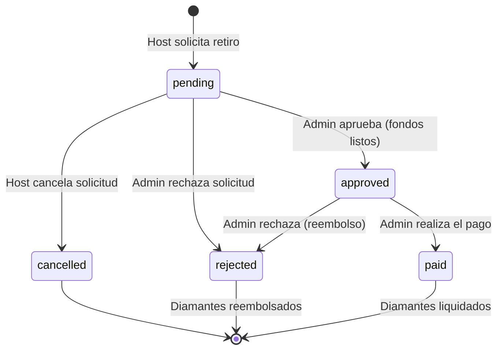

# Sistema de Retiros y Payouts para Hosts

Este documento describe la arquitectura, reglas y flujos de trabajo del sistema de retiros (payouts) para hosts dentro de **PartyLiveApp**.

---

## 1. Reglas de Negocio y Conversión

- **Tasa de Conversión:** 10,000 diamantes = $50 USD ($0.005 USD por diamante).
- **Monto Mínimo de Retiro:** 10,000 diamantes ($50 USD).
- **Comisiones de Plataforma:** $0 USD (gratis) por el momento.
- **Frecuencia y Tiempos de Procesamiento:** Las solicitudes son manuales. El procesamiento tarda entre 1 a 3 días hábiles.
- **Métodos Soportados:** PayPal, Transferencia Bancaria Directa, Payoneer.

---

## 2. Flujo de Estados de un Retiro

El ciclo de vida de una solicitud de retiro (`HostPayout`) sigue el siguiente diagrama de estados:



### Detalle de Estados

1. **Solicitado (`pending`):**
   - El host ingresa la cantidad de diamantes a retirar.
   - El backend realiza una transacción en la base de datos:
     - Deduce los diamantes de `availableDiamonds` en la billetera del host y los suma a `lockedDiamonds`.
     - Crea la solicitud en la colección `hostPayouts` con estado `pending`.
     - Crea un registro de tipo `withdrawal` con estado `pending` en `walletTransactions`.
     - Registra una actividad de host de tipo `payout_requested`.
   - Mientras la solicitud esté en `pending`, el host puede **cancelar** el retiro. Si lo hace, los diamantes bloqueados regresan al balance disponible.

2. **Aprobado (`approved`):**
   - El administrador revisa que el host no haya cometido infracciones o fraude.
   - Se cambia el estado de la solicitud a `approved`.
   - Se genera una actividad `payout_approved`. El host ya no puede cancelar la solicitud.

3. **Pagado (`paid`):**
   - El administrador realiza el pago manual (vía PayPal o transferencia) al método configurado por el host.
   - Marca la solicitud como `paid`.
   - El backend deduce definitivamente los diamantes bloqueados de `lockedDiamonds` y actualiza la transacción en `walletTransactions` a `completed`.
   - Incrementa el acumulado de diamantes retirados (`lifetimeDiamondsWithdrawn`).
   - Se genera la actividad `payout_paid`.

4. **Rechazado (`rejected`):**
   - Si el administrador decide rechazar la solicitud (por ejemplo, datos de cuenta incorrectos o sospecha de fraude), los diamantes en `lockedDiamonds` regresan a `availableDiamonds` en el perfil y billetera del host.
   - La transacción en `walletTransactions` se actualiza a `failed`.
   - Se genera la actividad `payout_rejected`.

---

## 3. Estructura de Datos en Firestore

### Colección: `hostPayoutMethods`
```typescript
interface HostPayoutMethod {
  id: string;
  hostId: string;
  type: 'paypal' | 'bank_transfer' | 'payoneer' | 'other';
  label: string; // Ej. "Mi PayPal Principal"
  details: {
    email?: string;
    accountHolderName?: string;
    bankName?: string;
    accountNumber?: string;
    routingNumber?: string;
  };
  maskedDetails: string; // Ej. "pe***@mail.com" o "**** 9283"
  isDefault: boolean;
  isActive: boolean; // Para soft-delete
  createdAt: Timestamp;
  updatedAt: Timestamp;
}
```

### Colección: `hostPayouts`
```typescript
interface HostPayout {
  id: string;
  hostId: string;
  amount: number; // Monto en USD
  diamondsConverted: number;
  status: 'pending' | 'approved' | 'paid' | 'rejected' | 'cancelled';
  payoutMethodId: string;
  payoutMethodType: string;
  payoutMethodLabel: string;
  payoutDetailsMasked: string;
  fee: number;
  netAmount: number;
  adminNotes?: string;
  createdAt: Timestamp;
  updatedAt: Timestamp;
  processedAt?: Timestamp;
  paidAt?: Timestamp;
  rejectedAt?: Timestamp;
  cancelledAt?: Timestamp;
}
```

---

## 4. Endpoints del API Backend

Todos los endpoints requieren autenticación mediante JWT (Firebase Auth). Las operaciones administrativas (`/admin/*`) requieren además el rol de `admin` o `moderator`.

### Endpoints para Hosts
- `GET /api/payouts/methods` - Obtener métodos de pago del host.
- `POST /api/payouts/methods` - Agregar nuevo método de pago.
- `PATCH /api/payouts/methods/:id` - Actualizar información del método de pago.
- `DELETE /api/payouts/methods/:id` - Desactivar (soft-delete) método de pago.
- `POST /api/payouts/request` - Solicitar retiro (body: `{ diamondsConverted, payoutMethodId }`).
- `GET /api/payouts/my` - Obtener historial de retiros del host.
- `POST /api/payouts/:id/cancel` - Cancelar una solicitud pendiente.

### Endpoints para Administradores
- `GET /api/payouts/admin/pending` - Listar solicitudes pendientes o aprobadas para pagar.
- `POST /api/payouts/admin/:id/approve` - Aprobar solicitud (body opcional: `{ adminNotes }`).
- `POST /api/payouts/admin/:id/reject` - Rechazar solicitud y reembolsar diamantes (body opcional: `{ adminNotes }`).
- `POST /api/payouts/admin/:id/mark-paid` - Marcar retiro como pagado exitosamente (body opcional: `{ adminNotes }`).
