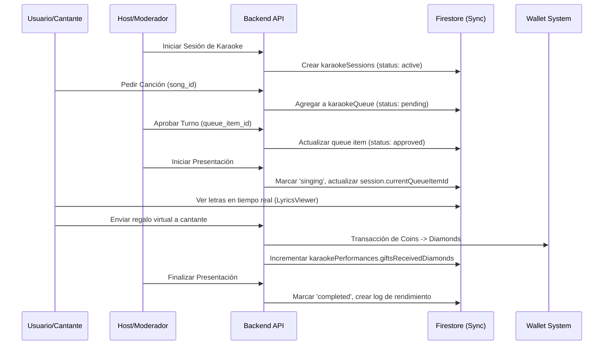

# Sistema de Karaoke - PartyLiveApp

Este documento describe la arquitectura, esquema de datos, integraciones de monetización y moderación del módulo de Karaoke para salas de voz y lives.

## 1. Arquitectura & Flujo

## 2. Estructura de Datos (Firestore)

### `karaokeSongs` (Colección Global)
Catálogo oficial y subido por usuarios:
* `id`: string
* `title`: string
* `artist`: string
* `language`: string
* `genre`: string
* `durationSeconds`: number
* `instrumentalUrl`: string
* `lyricsText`: string
* `status`: 'active' | 'inactive' | 'pending_review' | 'rejected'
* `playCount`: number
* `searchKeywords`: string[]

### `karaokeQueue` (Sub-colección / Colección Global)
Cola de reproducción por sesión:
* `id`: string
* `sessionId`: string
* `songId`: string
* `songTitle`: string
* `singerId`: string
* `singerName`: string
* `status`: 'pending' | 'approved' | 'singing' | 'completed' | 'skipped' | 'rejected'
* `position`: number
* `requestedAt`: timestamp

### `karaokePerformances`
Registro de rendimiento e ingresos históricos:
* `id`: string
* `sessionId`: string
* `singerId`: string
* `singerName`: string
* `songId`: string
* `giftsReceivedDiamonds`: number
* `beansGenerated`: number
* `completedAt`: timestamp

## 3. Integración de Monetización (Regalos)

Cuando se envía un regalo durante una sesión activa, el backend intercepta la operación en `giftWalletService.ts` para verificar si el destinatario está cantando actualmente. Si coincide, las estadísticas se asocian directamente con la performance activa, permitiendo rankings en tiempo real de los mejores cantantes monetizados del día.

## 4. Moderación y Seguridad

* **Control de Spam**: Los usuarios con estado `banned` o `suspended` no pueden encolar canciones.
* **Bloqueos directos**: Si un usuario está bloqueado por el anfitrión de la sala, no podrá interactuar con el sistema de karaoke dentro de esa sala.
* **Aprobación de Contenido**: El panel de administración Next.js permite auditar canciones subidas por los hosts antes de hacerlas públicas para toda la comunidad.
