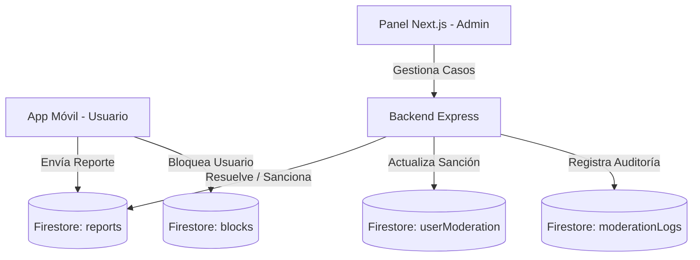

# Sistema de Moderación Completo - PartyLive

Este documento detalla el diseño, la arquitectura y el funcionamiento del sistema de moderación centralizado implementado en **PartyLive**. El objetivo principal es garantizar un entorno seguro, mitigar conductas indebidas y automatizar la aplicación de sanciones a nivel global y de sala/live.

---

## 1. Arquitectura y Flujo de Datos

El sistema está dividido en tres capas principales:
1. **Cliente Móvil (React Native):** Envía reportes directamente a Firestore y gestiona restricciones de cuenta de forma proactiva al interceptar el acceso de usuarios bloqueados/suspendidos/baneados.
2. **Backend (Node.js/Express):** Ejecuta acciones con privilegios elevados (`firebase-admin`) a través de un set de endpoints REST securizados, asegurando que las sanciones no puedan ser alteradas desde el cliente.
3. **Panel de Administración (Next.js):** Permite a los administradores y moderadores auditar reportes pendientes, aplicar advertencias, suspensiones, baneo de cuentas y bloqueo de billeteras, y visualizar logs.

---

## 2. Modelos de Datos (Firestore)

### `reports` (Colección Principal)
Almacena los reportes de comportamiento inapropiado.
* **`id`**: Autogenerado por Firestore.
* **`reporterId`**: ID del usuario que reporta.
* **`reporterName`**: Nombre en pantalla del reportero.
* **`targetType`**: `'user' | 'message' | 'room' | 'live' | 'gift' | 'host' | 'payout' | 'other'`.
* **`targetId`**: ID de la entidad reportada (UID de usuario, ID de mensaje, etc.).
* **`targetOwnerId`**: Propietario del contenido reportado (para salas, lives, mensajes).
* **`reason`**: `'spam' | 'harassment' | 'hate_speech' | 'sexual_content' | 'violence' | 'scam' | 'impersonation' | 'underage' | 'illegal_activity' | 'self_harm' | 'privacy' | 'other'`.
* **`description`**: Detalle opcional ingresado por el usuario.
* **`status`**: `'pending' | 'reviewing' | 'resolved' | 'rejected' | 'duplicate'`.
* **`priority`**: `'low' | 'normal' | 'high' | 'urgent'`.
* **`createdAt`**: Marca de tiempo de creación.
* **`updatedAt`**: Última actualización del reporte.

### `userModeration` (Colección de Estado)
Lleva el historial numérico y estado de restricciones de cada usuario.
* **`userId`**: UID del usuario.
* **`status`**: `'active' | 'warning' | 'suspended' | 'banned' | 'deleted'`.
* **`warningsCount`**: Cantidad total de advertencias acumuladas.
* **`suspensionsCount`**: Cantidad total de suspensiones.
* **`bansCount`**: Cantidad de baneos aplicados.
* **`suspendedUntil`**: Marca de tiempo hasta la cual el usuario no puede acceder (para suspensiones).
* **`bannedReason`**: Razón especificada del baneo o suspensión.

### `moderationLogs` (Auditoría Global)
Bitácora inmutable de todas las acciones tomadas por administradores o moderadores del sistema.
* **`actorId`**: UID del moderador/admin que ejecuta la acción.
* **`action`**: Sanción ejecutada (`warn_user`, `ban_user`, `hide_message`, `close_room`, etc.).
* **`targetType`**: Tipo de entidad afectada.
* **`targetId`**: ID de la entidad afectada.
* **`reason`**: Motivo de la acción aplicada.
* **`createdAt`**: Fecha del registro.

---

## 3. Endpoints del Backend (`/api/moderation`)

Todos los endpoints requieren autorización de administrador o moderador a través del middleware `requireAdminOrModerator`.

| Endpoint | Método | Cuerpo / Parámetros | Descripción |
| :--- | :---: | :--- | :--- |
| `/reports` | GET | `status`, `targetType`, `limit` | Obtiene reportes filtrados. |
| `/reports/:reportId/reviewing` | POST | — | Cambia el estado del reporte a `'reviewing'`. |
| `/reports/:reportId/resolve` | POST | `actionTaken`, `note` | Resuelve un reporte y aplica la sanción especificada. |
| `/reports/:reportId/reject` | POST | `note` | Rechaza un reporte sin tomar acciones. |
| `/users/:userId/warn` | POST | `reason`, `reportId` | Envía una advertencia al usuario y cambia su estado a `warning`. |
| `/users/:userId/suspend` | POST | `reason`, `durationHours` | Suspende temporalmente al usuario y le niega acceso. |
| `/users/:userId/unsuspend` | POST | `reason` | Remueve la suspensión del usuario. |
| `/users/:userId/ban` | POST | `reason`, `reportId` | Baneado permanente global. |
| `/users/:userId/unban` | POST | `reason` | Reactiva una cuenta baneada. |
| `/messages/hide` | POST | `targetType`, `parentId`, `messageId`, `reason` | Oculta/elimina un mensaje en sala o live. |
| `/rooms/:roomId/close` | POST | `reason` | Cierra definitivamente una sala de voz activa. |
| `/lives/:liveId/end` | POST | `reason` | Finaliza forzosamente una transmisión activa. |
| `/wallets/:userId/lock` | POST | `reason` | Bloquea transacciones financieras del usuario. |
| `/wallets/:userId/unlock` | POST | `reason` | Habilita transacciones de billetera nuevamente. |
| `/logs` | GET | `limit` | Obtiene el historial de auditoría de moderación. |

---

## 4. Flujo de Control en la App Móvil

### Restricción de Acceso (App Routing)
En `AppNavigator.tsx`, el estado de autenticación se evalúa junto al estado de moderación del usuario:
- Si `userProfile.status === 'banned'`, se renderiza `BannedAccountScreen` y se impide cargar los menús y navegadores principales de la aplicación.
- Si `userProfile.status === 'suspended'`, se calcula si la fecha actual es menor a `suspendedUntil`. De ser así, se le muestra la pantalla `SuspendedAccountScreen` donde solo se le permite cerrar sesión.
- Si la suspensión expiró, el usuario puede acceder normalmente (y su estado se actualiza en el siguiente login/acción).

### Filtro de Chat en Tiempo Real (Bloqueos)
Los hooks de mensajería `useRoom` y `useLive` integran de manera nativa la escucha activa del canal de bloqueos (`blocks`):
- Al cargar el chat, se inicia una suscripción en tiempo real a los IDs de usuarios bloqueados por el cliente actual.
- Los mensajes procedentes de emisores presentes en la lista negra se filtran y omiten en la visualización, garantizando privacidad inmediata e interactiva.

### Control de Re-ingreso por Expulsión (Kicks/Bans de Sala/Live)
- Al unirse a una sala (`joinRoom`) o live (`joinLive`), Firestore evalúa la existencia previa del registro del miembro o espectador.
- Si el registro posee la bandera `isKicked === true` o `isBannedFromLive === true`, la transacción de Firestore lanza un error de denegación, impidiendo que el usuario expulsado vuelva a perturbar la transmisión en curso.
